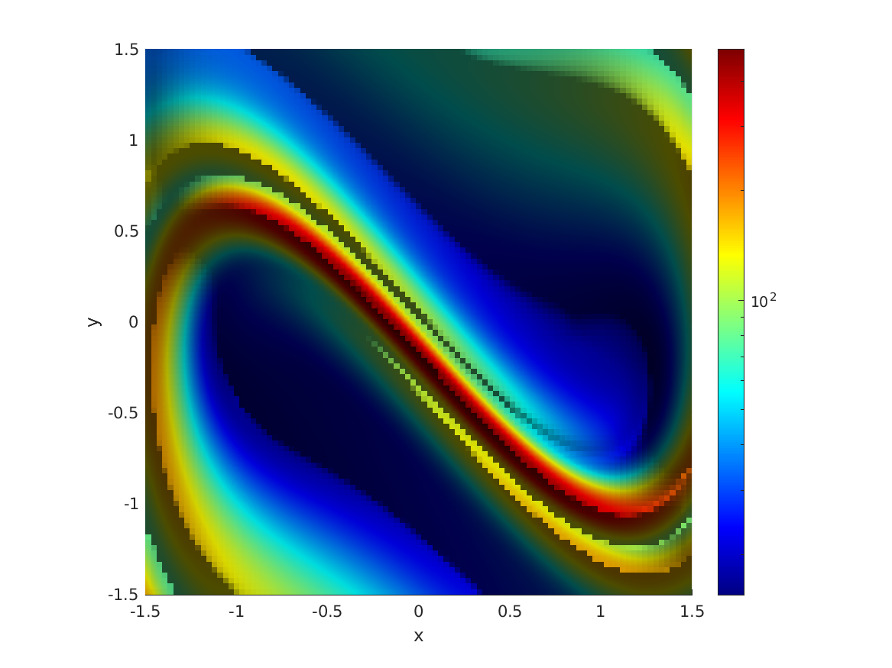

# Model Sensitivity


## License

This software is made public for research use only. It may be modified and redistributed under the terms of the GNU General Public License.


## Motivation

Calculation of bounds on prediction errors in dynamical systems subject to modeling uncertainties. 
The theory is discussed in the manuscript B. K., G. Haller, __Universal Upper Estimate for Prediction Errors under Moderate Model Uncertainty__ (submitted).

Given a known dynamical system in the form 
\begin{equation}
\dot{x} = f_0(x,t),
\end{equation}

we can quantify the prediction errors in the presence of modeling errors of the form

$$
\varepsilon g(x,t,\varepsilon) + \varepsilon \sigma(x,t) \xi(t),
$$

where $\xi(t)$ represents white noise. These bounds are expressed as functions of the invariants of the Cauchy-Green strain tensor of the idealized model:
$$
C_s^t(x_s) = \left[\nabla F_s^t(x_s)\right]^T\nabla F_s^t(x_s).
$$

Its leading eigenvalue is denoted by $\Lambda_s^t(x_s)$.

If $x^0_t$ is the idealized solution of $\dot{x}=f_0(x,t)$ and $x^\varepsilon_t$ is the real solution, the leading order error is bounded by

$$
\langle |x^0_t - x^\varepsilon_t|^2\rangle \leq  \left(\int_{t_{0}}^{t}\sqrt{\Lambda_{s}^{t}\left(x^0_{s}\right)}\,ds\right)^{2}\,\Delta_{\infty}^{2}(x_{0},t)+\int_{t_{0}}^{t}\mathrm{tr}\left[C_{s}^{t}\left(x^0_{s}\right)\right]\,ds\,\Delta_{\infty}^{\sigma}(x_{0},t) + O(\varepsilon^2).
$$

The quantities $\Delta_{\infty}$ and $\Delta_{\infty}^{\sigma}$ denote the maximal value of the modeling errors 
$$
\Delta_{\infty} = \text{max } |\varepsilon g(x,t,\varepsilon)|,
$$

$$
\Delta_{\infty}^\sigma = \text{max } \varepsilon^2 \text{ tr } \sigma(x,t)^T\sigma(x,t).
$$

Then, the system's sensitivity with respect to modeling errors can be characterized by the following scalar over the time interval $[t_0,t]$, at the point $x_0$, 
$$
\text{MS}_{t_0}^t(x_0) = \left( \int_{t_0}^t \sqrt{\Lambda_s^t\left(x^0_s\right)}ds\right)^2 + r \int_{t_0}^t \text{tr}[C_s^t\left(x^0_s\right)]ds,
$$

where $r = \Delta_{\infty}^\sigma / \Delta_{\infty}^2$.

## Installation

To install and run the examples
 
- Clone the repository `git clone https://github.com/balintkaszas/ModelSensitivity.git`
- In MATLAB, run the script `addPath.m`

## Implementation 

The software implements the calculation of the scalar field $\text{MS}_{t_0}^t(x_0)$. 
The idealized $n$-dimensional model must be provided in the form of a function handle. For example, the damped-driven Duffing oscillator (see below) may be specified as
```MATLAB
function dy = f0(t, x)
    dy(1) = x(2);
    dy(2) = x(1) - x(1)^3 - 0.15*x(2) + 0.3*cos(t);
end
```

The Jacobian of the system must also be given. For example, 
```MATLAB
function dyGrad = grad_f0(t, x)
    dyGrad = [0, 1; 1 - 2*x(1)^2, -0.15];
end
```
The invariants of the Cauchy-Green strain tensor may be computed from 

- finite differencing 
- using the equation of variations.

### Finite differencing 

For finite differencing, an auxiliary grid is used. If the difference between gridpoints is $\bar{\delta}$, then around each gridpoint, an auxiliary grid is created with size $\delta = 10^{-8}\bar{\delta}$. 
In this case, the Jacobian is not used for the calculation.

### Equation of variations

If the equation of variations is used, then the matrix-differential equation 

$$
\dot{\Phi} = \nabla f_0\left(x^0(t),t\right) \Phi
$$
is solved. The solution obeying the initial condition
$$
\Phi(t_0) = \text{Id}
$$

is the flowmap-gradient. 


## Example

As an example, let us assume that we wish to calculate MS for the damped-driven Duffing equation given by

$$
\dot{x}=y,
$$
$$
\dot{y} = x-x^3 -\delta y + A \cos t,
$$
with $\delta = 0.15$ and $A=0.3$. 

Also assume that the derivative is available as a function handle in the file `d_duffing.m` and the Jacobian is contained in `d_duffing_grad.m`

We first create a DynSystem object, by specifying the function handle, the dimensions of the phase space and the value of the model uncertainty: $\Delta_\infty$ and $\Delta_\infty^\sigma$. For simplicity, both deltas are chosen to be 1 here.

```
duffing = DynSystem(@(t,x) d_duffing(t,x), 2, [1,1], @(t,x) d_duffing_grad(t,x));
```

Next, we set up the computational domain by creating a Grid object. We specify a grid of 250 by 250, over the domain $(x,y)\in[-1.5,1.5]\times [-1.5,1.5] $.

```
resolution = [250, 250]; 
domain = [-1.5, 1.5; -1.5, 1.5];
init = Grid(2, [1,2], resolution, domain, 1e-3);
timeSpan = [0, pi];
```

Then we can call the wrapper to calculate MS by providing the necessary arguments. The fourth argument enables parallelization, the fifth specifies the desired accuracy for the integration. The last argument is the method for the calculation of the flow-map gradient, this can be either 'finitedifference' or 'eov'. 

```
ms = modelSensitivity(duffing, init, timeSpan, true, 1e-7, 'finitedifference');
```

The resulting MS field is 



## Validation 

An example, in which the MS field is computable analytically [2] is used for validation. The computation is detailed [here](test/validation.html).

